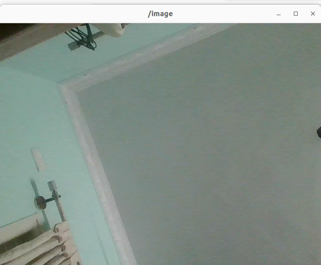
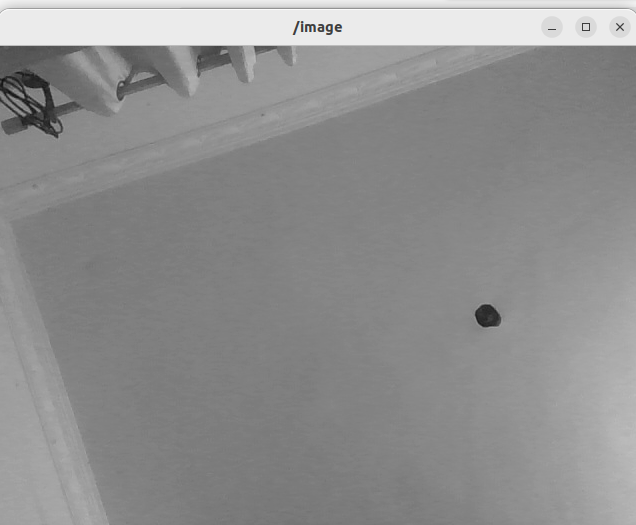
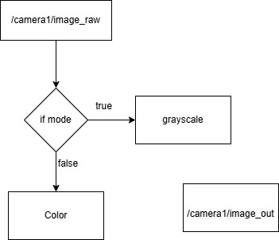

# Grayscale Color Converter Node

This ROS2 package contains a node for converting an image from color to grayscale and vice versa. The node subscribes to an image topic (published by the `usb_cam` package), processes the image based on the selected mode, and then publishes the result to another topic. This project is compatible with **ROS2 Humble**.

## Package Structure

- `ros2_ws.zip`: Contains the entire ROS2 workspace with necessary packages and configurations.

---

## Image Conversion Node

### Overview
The **image_conversion** node subscribes to the image topic (colored image) published by the `usb_cam` package. It offers a ROS2 service to switch between two modes:

1. **Mode 1: Greyscale** - Converts the input image to grayscale.
2. **Mode 2: Color** - Publishes the image without conversion.

### Service

The node hosts a service to toggle between the two modes. The service is of type `std_srvs/srv/SetBool` and accepts a boolean value to set the mode:

- **True**: Switch to Greyscale mode (Mode 1).
- **False**: Switch to Color mode (Mode 2).

The node then processes and publishes the image accordingly.

### Node Details

- **Subscribes to**: `/camera1/image_raw` (Image topic from the `usb_cam` package)
- **Publishes to**: `/camera1/image_out` (Processed image topic)

---

## Prerequisites

To use this package, you need the following ROS2 package:

- [**usb_cam**](https://index.ros.org/p/usb_cam/): A ROS2 driver for USB cameras.

Make sure to install and set up `usb_cam` correctly before running the node.

---
### Example Images

The following images demonstrate the output in both modes:

- **Color Mode**:
  

- **Grayscale Mode**:
  


## Data Flow

The data flow starts with the **usb_cam** package, which captures the raw image from the camera and publishes it to the `camera1/image_raw` topic. The **image_conversion** node then processes this image based on the selected mode (Color or Grayscale) and publishes the output to the `camera1/image_out` topic.

- **Color Mode**:
  

  
## How to Run

### Launching the Node

To launch the image conversion node and the camera:

```bash
ros2 launch cpp_package start.launch.py

next terminal

ros2 service call /change_mode std_srvs/srv/SetBool "{data: true}"

next terminal

ros2 run image_view image_view --ros-args -r image:=/camera1/image_out


